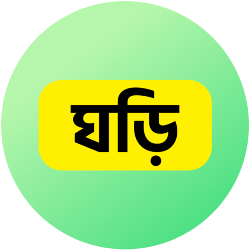

#  বাংলা ঘড়ি (Countdown Clock)
Countdown bangla clock show the date and time in Bengali font. Your simple and beautiful bangla clock for Android. It also show the Bengali day, months and seasons name, day and night length in hour/minute/second. You can also put the widget on your android home screen.

## Features:
- It shows time, minutes, second.
- It can show the bangla calendar date.
- Bangla, English and (arabic) Hijri calender.
- It can show the day of the week. In Bengali, English & Arabic.
- It can show Islamic prayer times.
- It can show the location of all the districts of Bangladesh and around the world during #sunrise and #sunset.

<a href="https://aladaapp.github.io/CountdownBanglaClock/"><strong>Web version ➥LIVE DEMO</strong></a>
